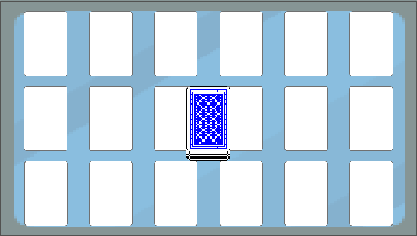
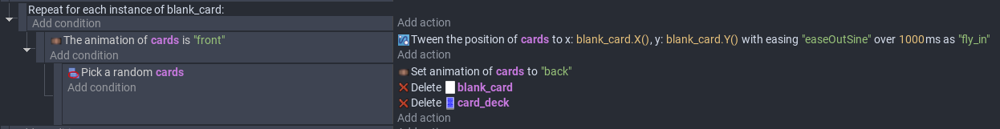
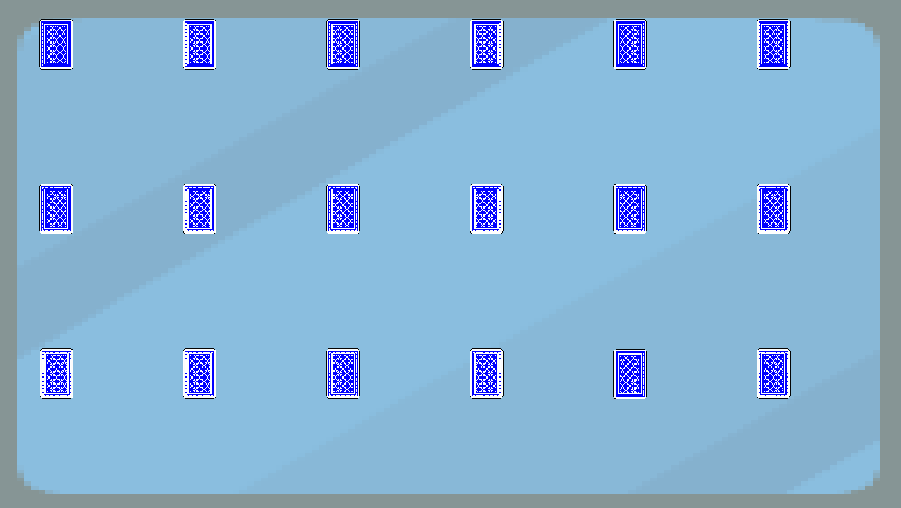

# Entry 3
##### 02/13/23

### Content

Me and my teammates had decided ro work separately on the mini games because there will be conflicts when saving if we worked on the same game but different computers. So, my mini game idea was matching the cards. The user will click on the card, it will flip and find a pair. I first imagined the game is on a table, so I used a background that's like a table and poker cards on top.

The blank poker cards serves like a placeholder and then when the game start the poker cards under the card deck it will shuffle and replace the blank cards. The blank cards and the card deck will be deleted and only shows the back of the cards.

This first took me a while to do so. First, in preview the cards were significantly large and only appear in the lower right corner. It's not replacing the blank cards and in the behavior, it did not have the action for the cards to 'fly_in'. I saw a blue add behavior button at the button, but I clicked on it several times and there's nothing happening. So, I Google searched up how to add a behavior. Thank God there's I found it in 1 search, otherwise I'll be stuck on this one step for longer.

The repeat for each instance is like a loop that for every place holder card. The tween the position will allow the cards to move towards the position of the place holders. 'Cards' is an object group that I placed all the playing cards in the group, so there's no need for the same code for every different playing card. The pick a random like it sounds a random card will fly to the placeholder. The cards were all facing down, so to check was it really random, I change to the "front", but it's showing only one card and it's the same card every time I preveiw, so I assume it was not random at all.

Another problem is that in preview, the back of the cards were very small. I adjusted the size when placing the cards, but it's not showing. I checked that the pixel were only 88X124 and maybe because it's the second animation of the front of the card, so the size didn't apply.

### EDP and Skills

The stage of engineering design process we are currently on is Create a prototype and Test and evaluate the prototype. We did some individual code. The create will be a long process and probably the biggest one for our project. We are also testing the mini games along creating it out because one step base upon the previous one. After the basics are done, we will try to improve the games a little. Two skills developed was How to Google and How to learn. At first, by default there wasn't that much functions for me to use and I have to google them to add a behavior and search up how to fill in the blank spaces in the conditions anf actions. And how to learn was some turtorials on youtude were years ago, layout and some functions were different, I have to decide with one to follow for my mini game.

[Previous](entry02.md) | [Next](entry04.md)

[Home](../README.md)
