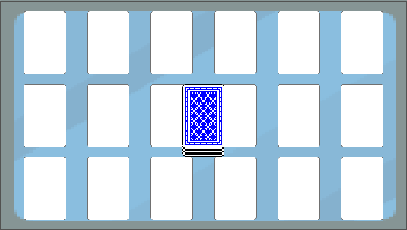

# Entry 3
##### 02/13/23

### Content

Me and my teammates had decided ro work separately on the mini games because there will be conflicts when saving if we worked on the same game but different computers. So, my mini game idea was matching the cards. The user will click on the card, it will flip and find a pair. I first imagined the game is on a table, so I used a background that's like a table and poker cards on top.

The blank poker cards serves like a placeholder and then when the game start the poker cards under the card deck it will shuffle and replace the blank cards. The blank cards and the card deck will be deleted and only shows the back of the cards.

### EDP and Skills

[Previous](entry02.md) | [Next](entry04.md)

[Home](../README.md)
