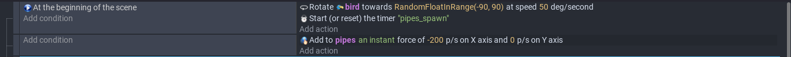
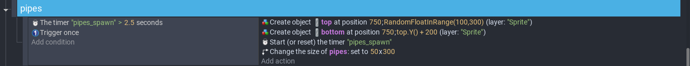
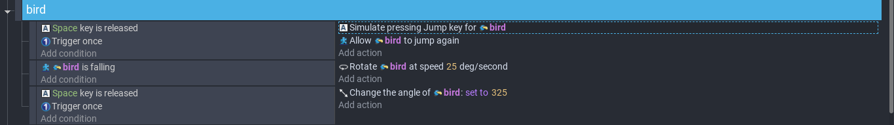

# Entry 4
##### 03/20/23

### Content

My will be using [GDevelop](https://editor.gdevelop.io/) for my Freedom Project. I used this [video](https://www.youtube.com/watch?v=dud10a_E9Pk) to make a flappy bird mini game. I have to switch to this game because the last game doesn't have a turtorial, so it's more difficult to finish.

This part is for when the game start, the bird would be randomly facing up. The timer would be started to count down for a new pipe to appear. The add an instant force on the pipes in the y direction would allow it to move towards the left.

For every 2.5 seconds, a top and bottom pipe will be appearing and the gap between them is fixed wih 200 pixels and the gap at random position. The timer will also reset, so when it reaches 2.5 second again, a new obstacle will appear. Because the length and width of the newly appear pipes is it's original size, so I have to change the size to fit the resolution.

The space key would be use for the bird to jump/fly in this case and because it's in air, we need to allow the bird to be able to jump constantly. The rotating is just to add more visual to the game, so when a bird is not falling, it's face would slowly turn down and when it gets back flying, it would go back up.

### EDP and Skills

The stage of engineering design process we are currently on is Create a prototype. We were in the progress of making one and we each just need to make at least one game. There is some testing the game involve, but because this is only the beginning, I couldn't really test the game as much. Once I'm done, I could start on the testing. The two skills developed was Attention to detail and Creativity. I want my flappy bird to have a different design, I will have to add different visual and animation to make it look nice. For the details, because the resolution for my game and the turtorial is different, I have to adjust basically all the numbers, so it's capable for my game.

[Previous](entry03.md) | [Next](entry05.md)

[Home](../README.md)
