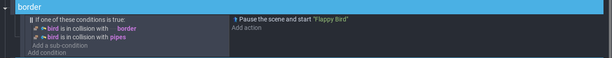
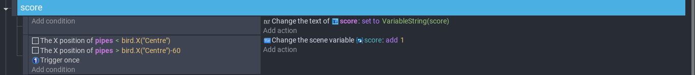

# Entry 5
##### 04/17/23

### Content

My tool for the Freedom Project is [GDevelop](https://editor.gdevelop.io/). I used this [video](https://www.youtube.com/watch?v=dud10a_E9Pk) to continue my project. This video is a turtorial to make flappy bird mini game. It's getting close to the day which we turn in like a draft of the project. It first had to work and meets our goal.

What I have left to do is a border, which when the bird bumps onto the pipe or fly too high or too low, it will die. Also added a score on the top left for the players to see.

The first line in the add condition is like a if statement with a or inside. So, when the bird hits the pipes or border, the scene will restart. Border is a line that I placed at the top and bottom, outside of the screen, so when the game runs the player won't see them. It's to make sure that the bird doesn't go off screen and use as a loop hole to get more points.

The score is just a text that's shown on the screen, so when have to set it as a variable in the line of add action. The x-position of bird is less than the center of the pipes and the x-position of bird is less than the center -60 of the pipes make sure that the score will only increase when the bird at least pass the middle of the pipe.

### EDP and Skills

The stage of engineering design process we are currently on is test and evaluate the prototype. We were done with at least one game and now we can ourself or let others try the game and get some feedback to help our next state Improve as needed. Two skills developed was How to learn and Communication. The turtorial I used were years back then and the version of Gdevelop was old, so some steps the youtuber was showing, doesn't work. I have to click on different buttons to find the condition or action that is required for the game. For communication, we have to report our process to each other because we have to turn it in soon. We tell each other issues we have and usually the other person has the solution. Like in the beginning we were working in different files because there will be a merge conflict and now we have to move everything back to the main file. When I was trying to copy and paste the code, it doesn't let me. I was afraid that I have to re-do all the code again. I told them in the group chat and Yuki said she could help me copy and paste.

[Previous](entry04.md) | [Next](entry06.md)

[Home](../README.md)
